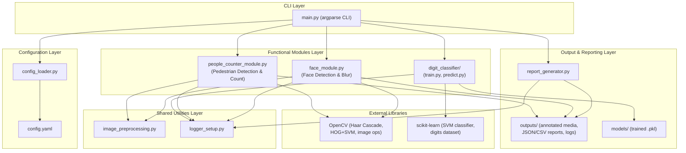

# System Architecture Diagram

VisionSuite follows a layered, modular architecture. The CLI layer never
talks to OpenCV/sklearn directly -- it always goes through a module wrapper,
which keeps the system testable and lets any module be replaced (e.g. HOG
swapped for a deep detector) without touching the CLI or the other modules.

**Layer responsibilities**

| Layer | Responsibility |
|---|---|
| CLI Layer | Parses arguments, dispatches to the correct module, owns the top-level error boundary |
| Configuration Layer | Loads and validates `config.yaml` into a typed `AppConfig` object |
| Functional Modules Layer | Implements the three core CV capabilities (detection, counting, classification) |
| Shared Utilities Layer | Reusable image-processing primitives and consistent logging, used by every module |
| Output & Reporting Layer | Persists annotated media, structured run reports (JSON/CSV) and rotating logs |
| External Libraries | OpenCV and scikit-learn provide the underlying CV/ML algorithms |
