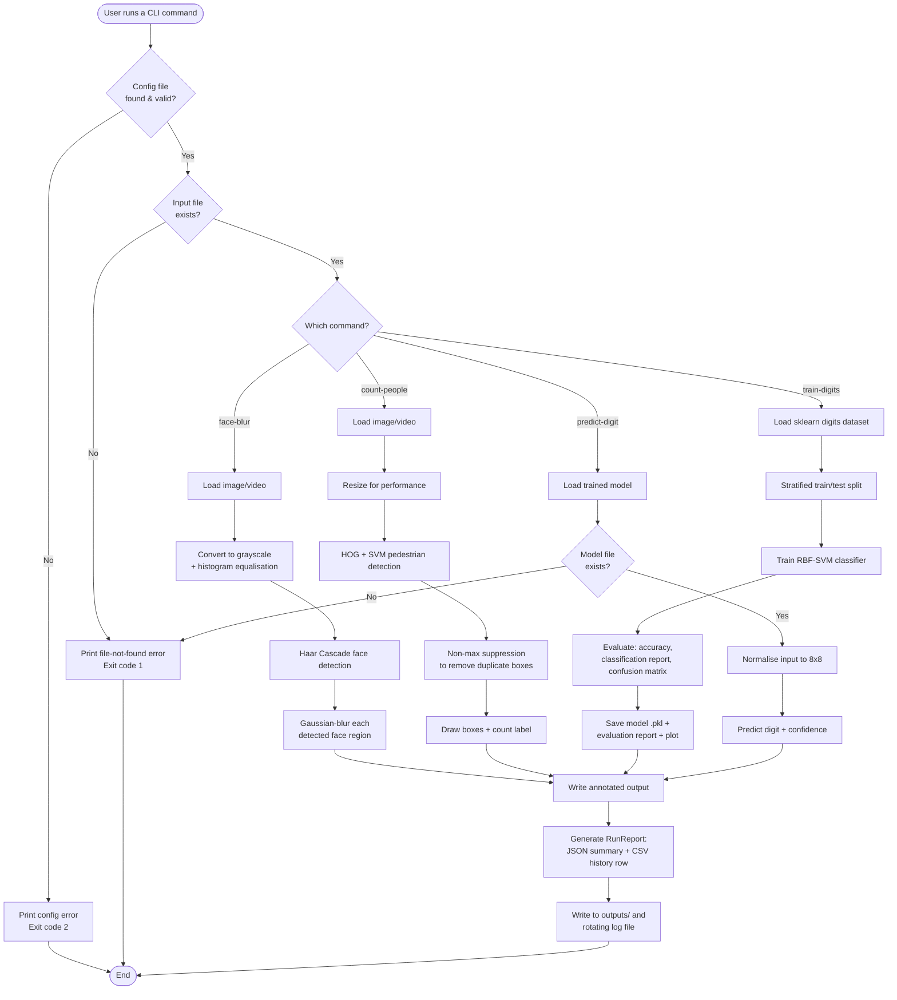

# Process Flow / Workflow Diagram

This shows the end-to-end flow for a single CLI invocation, common to all
three functional modules.

```mermaid
flowchart TD
    A([User runs a CLI command]) --> B{Config file<br/>found & valid?}
    B -- No --> B1[Print config error<br/>Exit code 2] --> Z([End])
    B -- Yes --> C{Input file<br/>exists?}
    C -- No --> C1[Print file-not-found error<br/>Exit code 1] --> Z
    C -- Yes --> D{Which command?}

    D -- face-blur --> E1[Load image/video]
    E1 --> E2[Convert to grayscale<br/>+ histogram equalisation]
    E2 --> E3[Haar Cascade face detection]
    E3 --> E4[Gaussian-blur each<br/>detected face region]
    E4 --> F[Write annotated output]

    D -- count-people --> P1[Load image/video]
    P1 --> P2[Resize for performance]
    P2 --> P3[HOG + SVM pedestrian detection]
    P3 --> P4[Non-max suppression<br/>to remove duplicate boxes]
    P4 --> P5[Draw boxes + count label]
    P5 --> F

    D -- train-digits --> T1[Load sklearn digits dataset]
    T1 --> T2[Stratified train/test split]
    T2 --> T3[Train RBF-SVM classifier]
    T3 --> T4[Evaluate: accuracy,<br/>classification report, confusion matrix]
    T4 --> T5[Save model .pkl +<br/>evaluation report + plot]
    T5 --> F

    D -- predict-digit --> Q1[Load trained model]
    Q1 --> Q2{Model file<br/>exists?}
    Q2 -- No --> C1
    Q2 -- Yes --> Q3[Normalise input to 8x8]
    Q3 --> Q4[Predict digit + confidence]
    Q4 --> F

    F --> G[Generate RunReport:<br/>JSON summary + CSV history row]
    G --> H[Write to outputs/ and<br/>rotating log file]
    H --> Z
```
