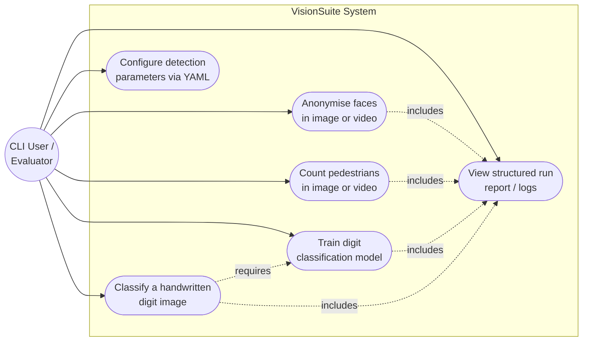

# Use Case Diagram

**Actors:** A single actor -- the CLI user (which may be a human developer or
an automated evaluation script) -- interacts with the system entirely
through the `main.py` command-line interface.

**Notes:**
- `Classify a handwritten digit` requires that `Train digit classification
  model` has been run at least once (a trained `.pkl` model must exist).
- Every use case implicitly includes generating a structured run report,
  supporting auditability.
