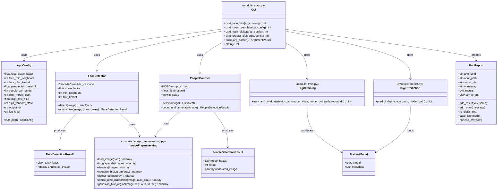

# Class / Component Diagram

```mermaid
classDiagram
    class AppConfig {
        +float face_scale_factor
        +int face_min_neighbors
        +int face_blur_kernel
        +float people_hit_threshold
        +int people_win_stride
        +str digit_model_path
        +float digit_test_size
        +int digit_random_state
        +str output_dir
        +str log_level
        +load(path) AppConfig$
    }

    class FaceDetector {
        -CascadeClassifier _cascade
        +float scale_factor
        +int min_neighbors
        +int blur_kernel
        +detect(image) List~Rect~
        +anonymise(image, draw_boxes) FaceDetectionResult
    }

    class FaceDetectionResult {
        +List~Rect~ faces
        +ndarray annotated_image
    }

    class PeopleCounter {
        -HOGDescriptor _hog
        +float hit_threshold
        +int win_stride
        +detect(image) List~Rect~
        +count_and_annotate(image) PeopleDetectionResult
    }

    class PeopleDetectionResult {
        +List~Rect~ boxes
        +int count
        +ndarray annotated_image
    }

    class TrainedModel {
        +SVC model
        +Dict metadata
    }

    class DigitTraining {
        <<module: train.py>>
        +train_and_evaluate(test_size, random_state, model_out_path, report_dir) dict
    }

    class DigitPrediction {
        <<module: predict.py>>
        +predict_digit(image_path, model_path) dict
    }

    class RunReport {
        +str command
        +str input_path
        +str output_dir
        +str timestamp
        +Dict results
        +List~str~ errors
        +add_result(key, value)
        +add_error(message)
        +to_dict() dict
        +save_json(path)
        +append_csv(path)
    }

    class ImagePreprocessing {
        <<module: image_preprocessing.py>>
        +load_image(path) ndarray
        +to_grayscale(image) ndarray
        +denoise(image) ndarray
        +equalize_histogram(gray) ndarray
        +detect_edges(gray) ndarray
        +resize_max_dimension(image, max_dim) ndarray
        +gaussian_blur_region(image, x, y, w, h, kernel) ndarray
    }

    class CLI {
        <<module: main.py>>
        +cmd_face_blur(args, config) int
        +cmd_count_people(args, config) int
        +cmd_train_digits(args, config) int
        +cmd_predict_digit(args, config) int
        +build_arg_parser() ArgumentParser
        +main() int
    }

    CLI --> AppConfig : loads
    CLI --> FaceDetector : uses
    CLI --> PeopleCounter : uses
    CLI --> DigitTraining : uses
    CLI --> DigitPrediction : uses
    CLI --> RunReport : creates

    FaceDetector --> FaceDetectionResult : produces
    FaceDetector --> ImagePreprocessing : uses
    PeopleCounter --> PeopleDetectionResult : produces
    PeopleCounter --> ImagePreprocessing : uses
    DigitTraining --> TrainedModel : produces
    DigitPrediction --> TrainedModel : loads
```
