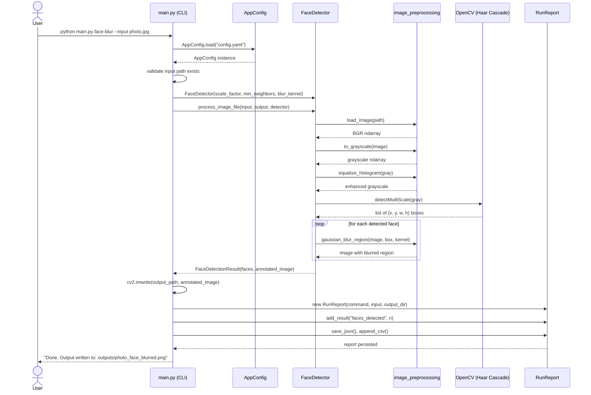

# Sequence Diagram -- `face-blur` command (representative example)

The `count-people` and `train-digits` / `predict-digit` flows follow the
same shape: CLI parses input → loads config → delegates to the relevant
module → module uses shared preprocessing + the underlying CV/ML library →
result is written to disk and summarised in a `RunReport`.
